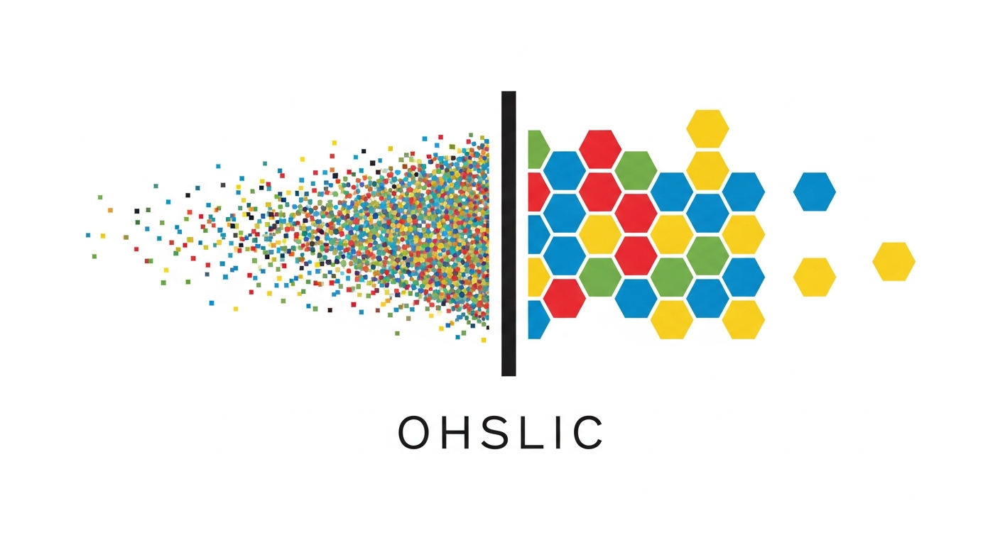
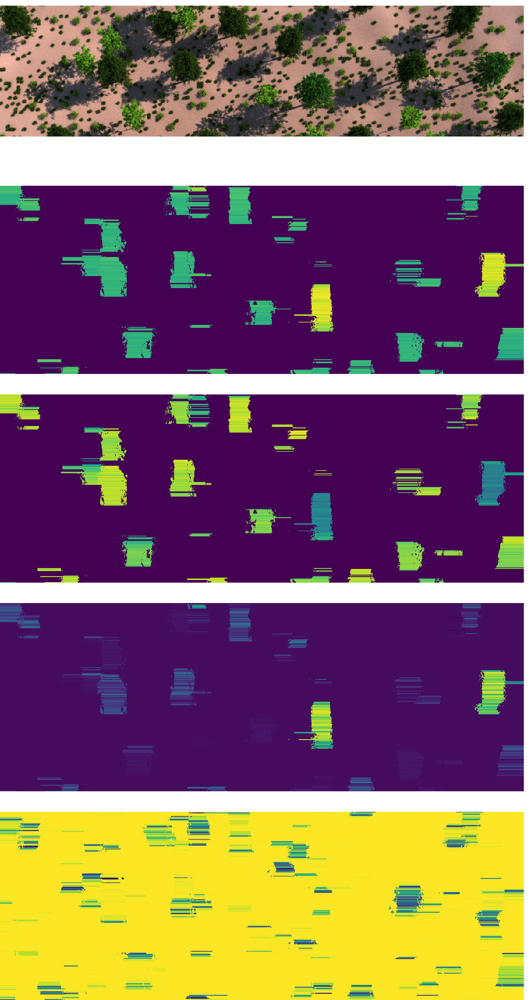
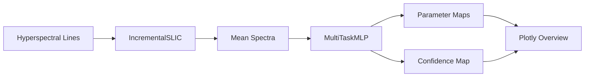

<p align="center">
   <picture>
      <source media="(prefers-color-scheme: dark)" srcset="docs/OHSLIC_logo_dark_GHColour.png" />
      
   </picture>
</p>

# OHSLIC – Online Hyperspectral Segmentation with Learned Incremental Clustering

OHSLIC accompanies the adaptive clustering paper and bundles the code required to reproduce the incremental superpixel refinement pipeline. The repository mirrors the structure of the LISA project: a lightweight Python package living under `src/ohslic`, CLI entry points, pretrained weights, and example artefacts for quick experimentation.

## Highlights

- Incremental SLIC variant (`IncrementalSLIC`) tailored for line-wise hyperspectral acquisition.
- Multi-task spectral regressor with shared CNN trunk delivering chlorophyll, carotenoid, and anthocyanin estimates.
- Ready-to-run CLI (`python main.py process` or `ohslic process`) handling the shipped sample capture in minutes.
- Plotly overview visualising RGB proxy, parameter heatmaps, and per-pixel confidence.
- Modular `src/ohslic` package with composable data, model, pipeline, and visualisation helpers.

## Quickstart

1. Clone the repository and move into it:
   ```bash
   git clone https://github.com/ciemcornelissen/OHSLIC.git
   cd OHSLIC
   ```
2. Create and activate an environment (Python 3.11+ recommended):
   ```bash
   python -m venv .venv
   source .venv/bin/activate  # Windows: .venv\Scripts\activate
   ```
3. Install dependencies:
   ```bash
   pip install -r requirements.txt
   ```
4. (Optional) Install the package in editable mode to expose the `ohslic` module globally and register the console script:
   ```bash
   pip install -e .
   ```
5. Download the public example capture (creates the `data/` folder with the HDF5 pair):
   ```bash
   python scripts/download_example_data.py
   ```

6. Run the demo pipeline:
   ```bash
   python main.py process --save-png --save-npz
   ```
   The command loads the pretrained checkpoint, segments the sample capture, saves the inference tensors to `results/generated/ohslic_output.npz`, and renders a high-resolution PNG overview in `results/generated/ohslic_overview.png`.

   After installing in editable mode you can also use the registered console script:
   ```bash
   ohslic process --save-png --save-npz
   ```

## Sample Data

Use `python scripts/download_example_data.py` to fetch the example capture from the KU Leuven/imec Nextcloud. The script downloads the `OHSLIC_hyperspectral_example` archive, unpacks it into `data/`, and leaves two HDF5 files:

- `data/hsi_data_line_example.h5` – spectral lines (256 × 1024 × 213).
- `data/hsi_label_line_example.h5` – reference chlorophyll/carotenoid/anthocyanin values.

The CLI defaults to this directory; point `--data-dir`, `--features-file`, or `--labels-file` to substitute your own captures.

## Example Output

<p align="center">
   
</p>

## Pretrained Model

`models/pixel_classifier_efficient_0.90_0.79_0.94_0.96.pth` holds the multi-task regressor used in the paper. The loader understands checkpoints with a `model_state_dict` key, so replacing the file with an updated export requires no code changes.

## Usage

Process a capture (defaults shown):
```bash
python main.py process \
  --data-dir data \
  --model-path models/pixel_classifier_efficient_0.90_0.79_0.94_0.96.pth \
  --n-clusters 25 \
  --feature-weight 30 \
  --spatial-weight 3 \
  --confidence-threshold 0.8
```

Key flags:
- `--save-png` – export the Plotly overview as a PNG snapshot (requires Kaleido, installed via `requirements.txt`).
- `--save-html` – persist the interactive Plotly overview instead of opening a browser window.
- `--save-npz` – store the spectral parameters and confidences as a compressed archive.
- `--disable-confidence` – turn off adaptive cluster splitting for ablation experiments.
- `--downsample-stride` – control spectral subsampling used during SLIC assignments.
- The CLI prints both wall-clock timings and lines-per-second throughput for quick performance checks.

## Experimentation

- Adjust `--n-clusters` to explore coarser (lower values) versus finer (higher values) superpixel partitions. Rerun the pipeline and inspect throughput alongside the PNG/HTML artefacts to gauge the trade-off.
- Control the adaptive split logic with confidence flags: lower `--confidence-threshold` values make the segmenter more tolerant, while `--disable-confidence` removes the split heuristic entirely for baseline comparisons.
- Combine these options when sweeping hyperparameters. For example:
   ```bash
   python main.py process --n-clusters 40 --confidence-threshold 0.7 --save-png
   python main.py process --n-clusters 20 --disable-confidence --save-png
   ```
   Compare the produced figures and timings in `results/generated/` to quantify how the settings impact segmentation density and runtime.

## Repository Layout

- `main.py` – thin wrapper delegating to the CLI entry point.
- `src/ohslic/` – core package components:
  - `data.py` – HDF5 loaders, dataset wrapper, RGB projection helper.
  - `models.py` – multi-task CNN/MLP architecture and checkpoint utilities.
  - `pipeline.py` – orchestration glue combining loaders, models, and the segmenter.
  - `segmentation.py` – incremental SLIC implementation and line-level inference.
  - `visualization.py` – Plotly figure factory for overview dashboards.
   - `cli.py` – argparse-based interface exposed by `main.py` or the `ohslic` console script.
- `models/` – pretrained checkpoints (kept small enough for git).
- `data/` – download destination for the public example capture (ignored by git).
- `relevantInformation/` – paper figures, plots, and supplementary material.
- `results/generated/` – created on demand to host inference artefacts.

## Architecture Overview



## Notes

- The incremental segmenter operates line-by-line; adjust `--n-clusters` and the feature/spatial weighting to match new sensors or motion patterns.
- Inputs are expected to be normalised reflectance in `[0, 1]`. Clip/scale custom datasets before ingestion if necessary.
- For larger captures, consider streaming them in batches and persisting intermediate predictions instead of holding full cubes in memory.

## Citation

If you build upon this work, please cite the associated manuscript (see `relevantInformation/Adaptive_Clustering_for_Efficient_Phenotype_Segmentation_of_UAV_Hyperspectral_Data.pdf`).
